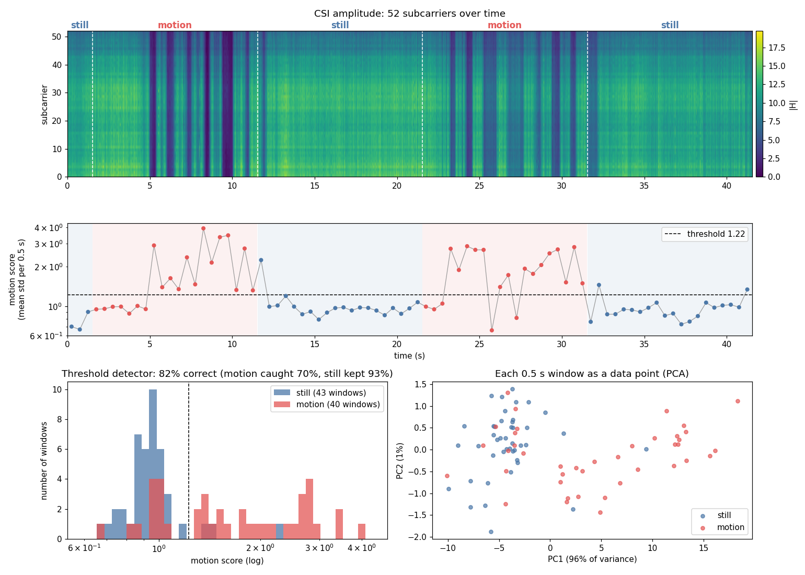
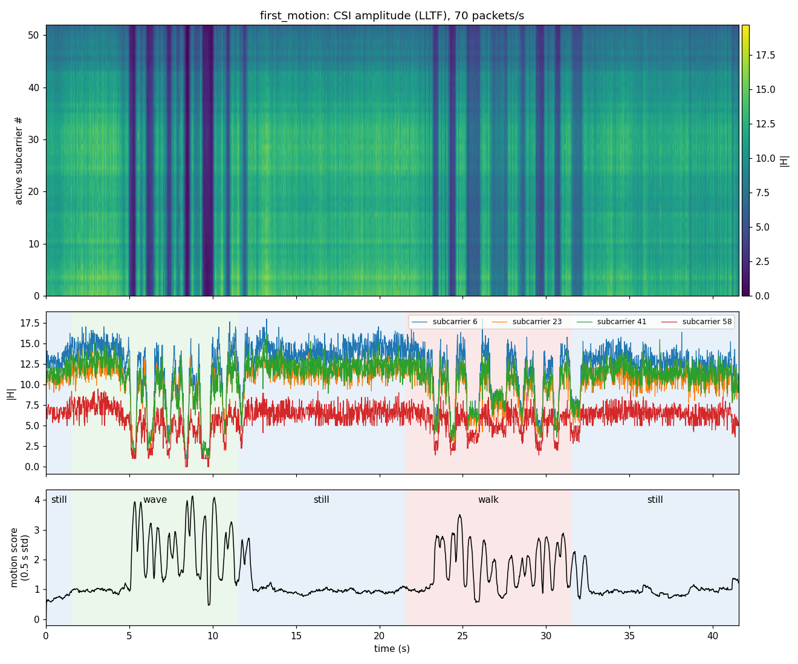
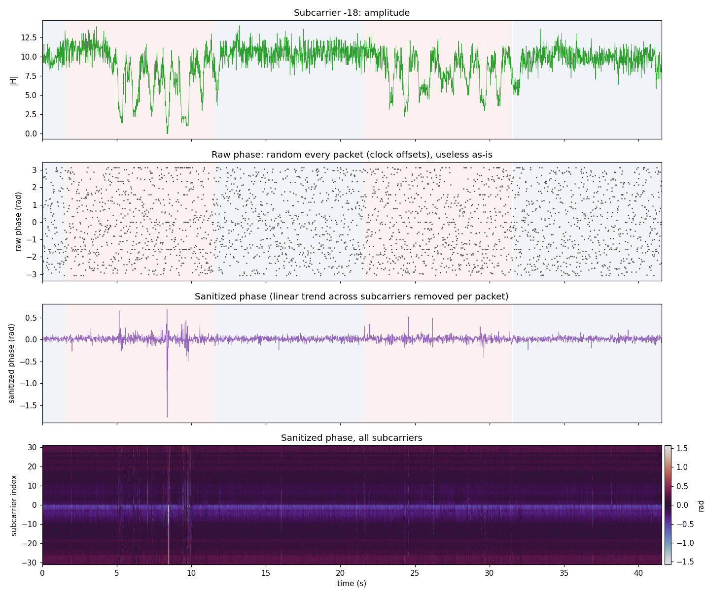

# Motion detection with two ESP32-S3 boards (Wi-Fi CSI)

A first experiment in Wi-Fi sensing: detecting human motion using only **two ESP32-S3 boards**, one transmitting and one receiving, and the **channel state information (CSI)** the receiver reports for every packet. No cameras, wearables or extra hardware.



## Setup

- **Hardware:** 2 × ESP32-S3 dev boards (on-board PCB antennas), about 80 cm apart, line of sight.
- **Firmware:** Espressif's [esp-csi](https://github.com/espressif/esp-csi) `get-started` examples, unmodified (`csi_send` on one board, `csi_recv` on the other), built with ESP-IDF v5.5.
- **Link:** ESP-NOW on Wi-Fi channel 11, about 70 CSI packets/s reaching the laptop over serial at 921600 baud.
- **CSI used:** amplitude of the 52 active subcarriers of the legacy LTF.

## Experiment

One 50 s recording with spoken cues: still, motion, still, motion, still (10 s each). Motion was a hand waving through the link in both motion phases.

## Results

| | Still | Motion |
|---|---|---|
| Median motion score (mean per-subcarrier std over 0.5 s) | 0.95 | 1.58 (1.7×) |

- A single threshold on the motion score classifies **82% of 0.5 s windows** correctly: 93% of still windows and 70% of motion windows.
- Most missed motion windows are in the first ~3 s of each motion phase, while moving into position after the cue, so the labels lead the actual motion.
- In a PCA of per-window features, still windows form a tight cluster and motion windows spread away from it.
- At this short range, motion mostly **shadows the direct path**: all subcarriers dim together (the dark bands in the heatmap below), so RSSI also reacts.



### Phase

Raw ESP32 CSI phase is random from packet to packet (clock offsets). After removing the linear phase trend across subcarriers per packet, the sanitized phase is stable when still and fluctuates about twice as much during motion.



## Code

| File | Purpose |
|---|---|
| `logger.py` | Record labelled CSI from the receiver over serial, with timed phases and optional voice cues |
| `plot_csi.py` | Amplitude heatmap, subcarrier traces and motion score |
| `static_vs_motion.py` | Window-level static vs motion analysis (threshold detector, histogram, PCA) |
| `analyze_csi.py` | Packet-level PCA, RSSI comparison and spectrogram |
| `phase_check.py` | Raw vs sanitized phase |

```bash
python logger.py --phases still:10,wave:10,still:10,walk:10,still:10 --name first_motion --speak --delay 20
python static_vs_motion.py first_motion
```

Requires `pyserial`, `numpy` and `matplotlib`. The recording is in `data/first_motion.csv`.

## Next

- Longer range and motion toward/away from the receiver (multipath and Doppler rather than direct-path shadowing).
- Position fingerprinting: does CSI separate where a person stands?
- Wi-Fi FTM ranging between the two boards as a second localization modality.
